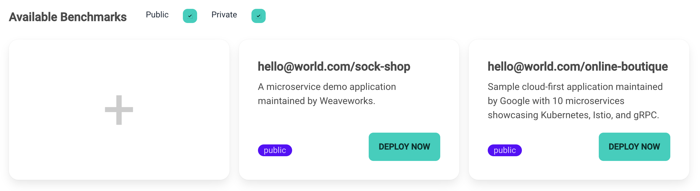

# Benchmark

## Benchmark列表

 

[//]: # (![benchmark]&#40;assets/doc/img/benchmark.png&#41;)

Benchmark模块首页是以卡片形式展示的benchmark微服务列表，可以通过选择`public`
或`private`来筛选所有用户公开的benchmark或自己私有的benchmark。

如果你想部署一个微服务系统，可以如下图所示，点击对应benchmark卡片上的`DEPLOY NOW`按钮，根据弹窗提示输入对该系统的命名，再点击YES即可。

 

[//]: # (![image-20230901115053556]&#40;https://wanz-bucket.oss-cn-beijing.aliyuncs.com/typora/image-20230901115053556.png&#41;)

如果你想上传自己的benchmark，只需要点击第一个`+`号卡片，就会跳转到[新增页](/doc/zh/benchmark.md#新增页)，按要求填写信息并上传文件即可。

## 添加Benchmark

 

按输入框的提示，填写benchmark名字与描述（将会显示在首页的卡片中）、选择benchmark可见性并上传部署相关的文件即可。

**注：请仔细阅读平台对上传文件的要求，并根据错误提示修改**。

 

简单来说，平台只允许上传README以及用于部署的YAML文件，而且YAML文件只允许存在Deployment、Service、Configmap以及Secret四种资源。

## Benchmark文件

文件页以类似Github的界面展示benchmark相关文件，页面右上角支持多种操作：
- 如果你是benchmark的拥有者，则你可以下载、更换以及删除benchmark文件。
- 如果你不是benchmark的拥有者，则你仅有下载这一权限。

